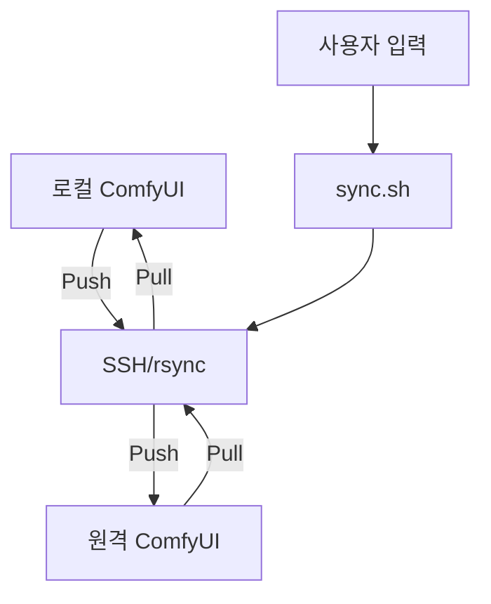

# ComfyUI 모델 동기화 기능 기획서

## 개요
ComfyUI에서 사용하는 모델 파일을 로컬 컴퓨터와 원격 서버 간에 효율적으로 동기화할 수 있는 스크립트를 구현합니다. 이를 통해 모델 관리와 백업이 용이해집니다.

## 기능 요구사항
1. 로컬에서 원격 서버로 모델 폴더 전송 (Push)
2. 원격 서버에서 로컬로 모델 폴더 가져오기 (Pull)
3. 사용자 친화적인 인터페이스 제공
4. 원격 호스트 및 포트 정보를 유연하게 입력 가능

## 기술 스택
- Bash 스크립트
- rsync (원격 파일 동기화 도구)
- SSH (원격 접속)

## 시스템 아키텍처



## 구현 세부사항
- 스크립트 이름: `sync.sh`
- 기본 파라미터:
  - `--push`: 로컬에서 원격으로 전송
  - `--pull`: 원격에서 로컬로 가져오기
  - `--help`: 도움말 표시
- 원격 연결 파라미터:
  - `--host 사용자명@원격IP`: 원격 호스트 정보
  - `--port 포트번호`: SSH 포트 번호
- 설정 변수:
  - 원격 경로: ~/Desktop/ComfyUI/
  - 로컬 경로: models/

## 사용 방법
1. 로컬에서 원격으로 모델 전송 (호스트와 포트 인자 사용):
   ```bash
   ./sync.sh --push --host user@192.168.1.100 --port 22
   ```

2. 로컬에서 원격으로 모델 전송 (대화형 입력):
   ```bash
   ./sync.sh --push
   # 이후 호스트와 포트 입력 프롬프트가 표시됨
   ```

3. 원격에서 로컬로 모델 가져오기:
   ```bash
   ./sync.sh --pull --host user@192.168.1.100 --port 22
   ```

4. 도움말 표시:
   ```bash
   ./sync.sh --help
   ```

## 향후 개선사항
- 설정 파일을 통한 옵션 관리
- 특정 모델만 선택적으로 동기화하는 기능
- 동기화 로그 기록 및 관리
- 증분 백업 지원
- 설정 저장 및 불러오기 기능 